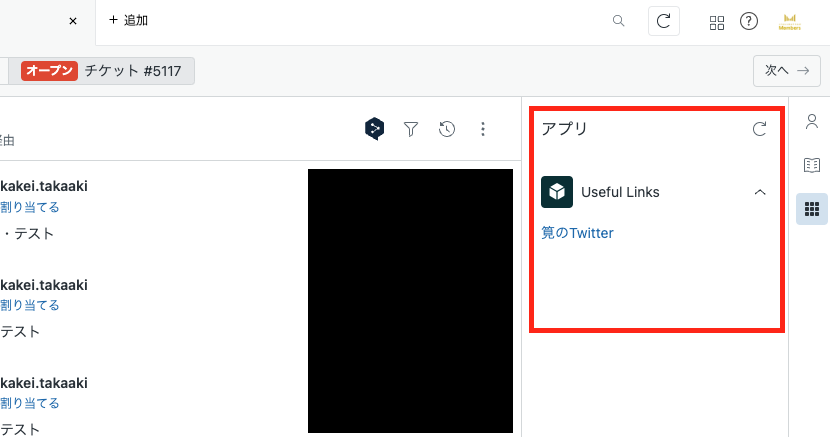

# App name

blog_zendesk_useful_links

### The following information is displayed:

- Zendesk のコンテキストパネルにお役立ちリンク集を表示するアプリ（ブログ用）

### Screenshot(s):



### SetUp

```bash
# インストール
npm install @zendesk/zcli -g

# 認証情報のセットアップ
zcli login -i
```

### Develop

```bash
# サブドメインの切り替え
zcli profiles:list
zcli profiles:use サブドメイン名

# ステージに切り替え
cd ステージ名

# ローカルサーバーでの起動
zcli apps:server
```

ローカルサーバーを起動した状態で、以下の URL にブラウザでアクセスすると、Zendesk 上でアプリを確認できる。
キャッシュの影響を受けないために、シークレット ウィンドウで開くの推奨。
`https://サブドメイン名.zendesk.com/agent/tickets/チケット番号?zcli_apps=true`

### Deploy

```bash
# ステージに切り替え
cd ステージ名

# サブドメインの切り替え
zcli profiles:list
zcli profiles:use サブドメイン名

# 初回（zcli.apps.config.jsonがない場合）
zcli apps:create

# 更新
zcli apps:update
```
